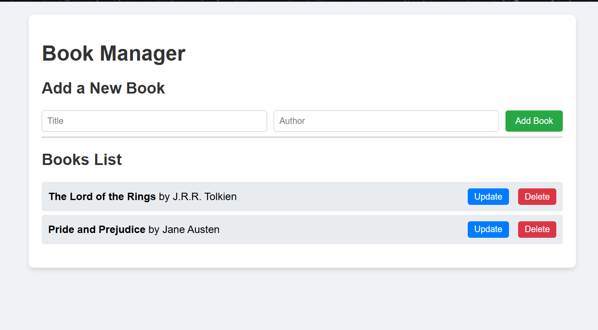

# 📚 Book Manager App 📖

A simple, responsive **Book Manager Application** built with **HTML**, **CSS**, and **JavaScript**. This project allows users to create, manage, and track their personal book collection with ease and style.

---

## 🔍 Preview

Below are some screenshots showcasing the book manager's interface:

  


---

## ✨ Features

✅ **Book Management**  
➕ Easily add new books to your collection with details like title, author.  
✏️ Edit existing book name and author.  
🗑️ Remove books you no longer wish to track.

📱 **Responsive Design**  
🔄 Adapts to different screen sizes including mobile, tablet, and desktop.

🧼 **Minimal & Clean UI**  
🖌️ Styled using a consistent color palette and modern typography for a great user experience.

---

## 📂 Folder Structure
3rd_task/
├── backend/
│ └── server.js
├── README.md
├── app.js
└── index.html

---

## 🚀 Getting Started

1. Clone the repository.
2. Navigate to the `3rd_task` folder.
3. Open `index.html` in your browser to view the app.
4. If using backend features, run the `server.js` file using Node.js.

```bash
cd backend
node server.js


