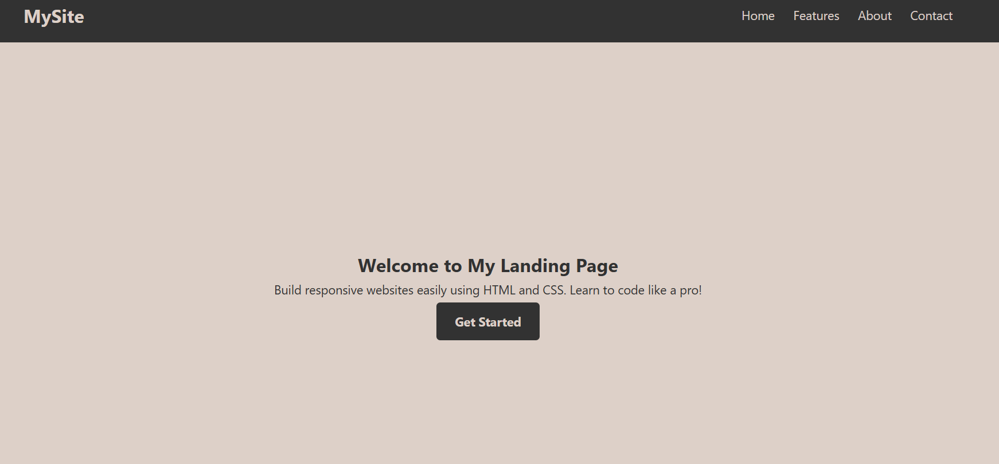
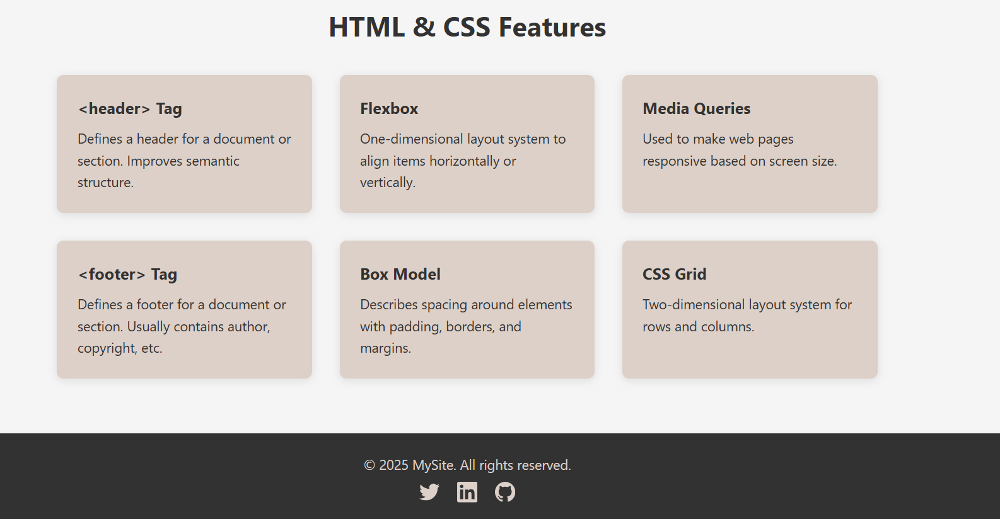

# 🌐 Basic Landing Page 🌟

A clean, responsive **Landing Page** built using **HTML** and **CSS**. This project demonstrates fundamental front-end development skills with scroll-based navigation and section-based content display.

---

### 🔍 Preview  
Below are some screenshots showcasing the landing page design:

*(Make sure these images are in the same folder or properly linked if you're hosting them)*

## ✨ Features

✅ **Smooth Scroll Navigation**  
📍 Clickable menu to jump between sections: *Home*, *Features*, *About*, etc.

🎯 **Section Highlights**  
🏠 Home section displays a welcome message  
📋 Features section showcases feature cards with HTML and CSS highlights  

📱 **Responsive Design**  
🔄 Adapts to different screen sizes including mobile, tablet, and desktop  

🧼 **Minimal & Clean UI**  
🖌️ Styled using consistent color palette and modern typography  

---

## 📂 Folder Structure
landing-page/
├── index.html
├── style.css
├── task1_ss1.png
├── task1_ss2.png
└── README.md