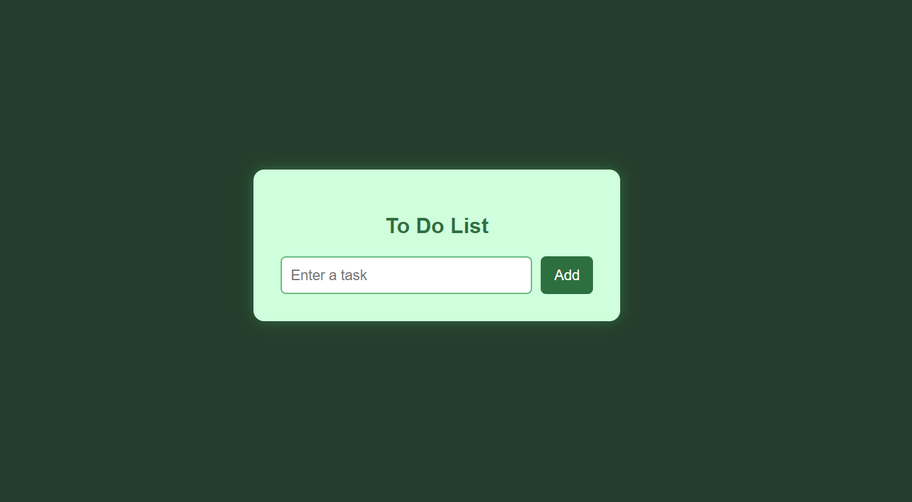
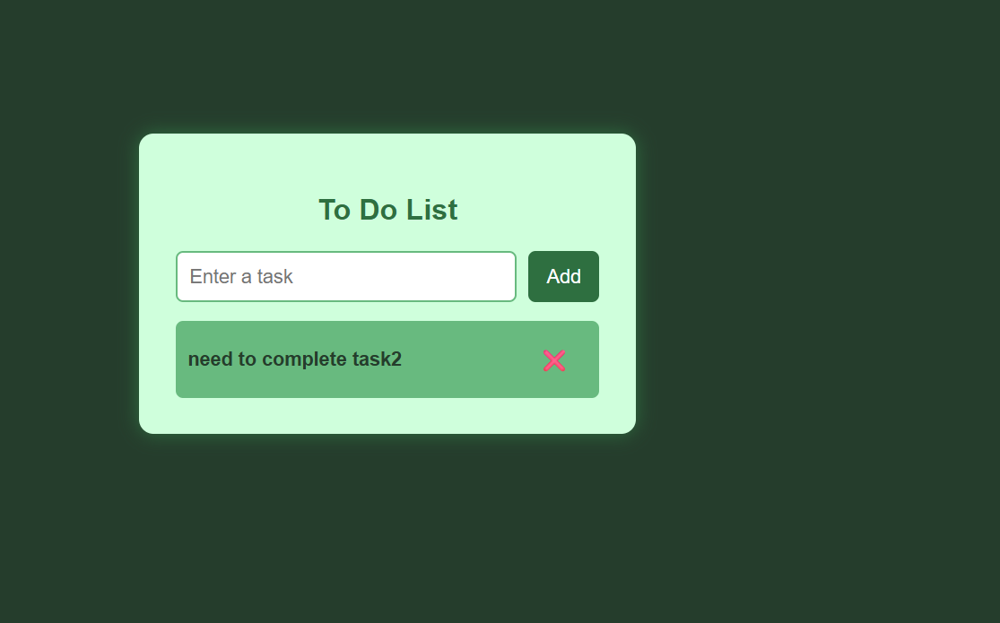

# ✅ To-Do List Web App 📋

A clean and simple **To-Do List** web application built using **HTML, CSS, and JavaScript**. This app helps users manage their daily tasks with real-time add/delete functionality and a responsive card-based UI.

---

## 🖥️ Demo

### 🔍 Preview  
📷 Screenshots:  
### 🔹 Main Interface

### 🔹 Tasks Added

 

*(Make sure to upload these screenshots in the same folder or update the paths accordingly)*

### 🚀 Live Demo  
Check out the app live at:  
🔗 **Live Demo - To-Do List Web App** *(Insert GitHub Pages or Netlify link here)*

---

## ✨ Features

📝 **Add Tasks**  
➕ Type a task and click "Add" to insert it into your list  

❌ **Delete Tasks**  
🗑️ Each task has a delete icon — click to remove it instantly  

🔄 **Live Task Updates**  
🚀 Task list updates dynamically using JavaScript DOM manipulation  

🎨 **Card-Based UI**  
✅ Clean UI with styled input, button, and responsive task cards  

📱 **Responsive Design**  
🌐 Works on mobile, tablet, and desktop devices  

---

## 📂 Folder Structure
├── index.html
├── style.css
├── script.js
├── todo_ss1.png
├── todo_ss2.png
└── README.md

---

## 🛠️ Tech Stack

- 💻 **HTML5** – Structure
- 🎨 **CSS3** – Styling and layout
- ⚙️ **JavaScript** – DOM manipulation & interactivity

---

## 💡 Future Enhancements

- ⏰ Add due date or time reminders
- ✅ Mark tasks as completed (checkbox)
- 📝 Edit task feature
- 💾 Store tasks using `localStorage`
- 📊 Task counter or category filters

