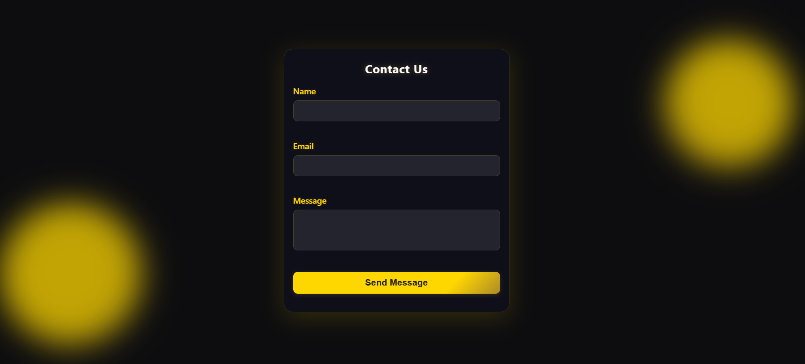

# Contact Form with Client-Side Validation

## Objective
Create a simple, styled contact form that validates **Name**, **Email**, and **Message** fields in the browser before allowing submission.

## Tools Used
- **VS Code** (for coding)
- **Chrome Browser** (for testing HTML/CSS/JS)

## Features
- HTML form with:
  - **Name** (required)
  - **Email** (required, valid format with regex)
  - **Message** (required)
  - Submit button
- CSS styling for clarity and readability
- JavaScript validation:
  - Prevents submission if fields are empty or email format is invalid
  - Displays error messages under the relevant fields
  - Shows a success message when all inputs are valid (no message is actually sent)
- Covers edge cases (empty inputs, bad emails, special characters)

## Screenshot
Below is the screenshot showing the form layout and validation in action:

## Discussion
This contact form combines clear styling and robust client-side validation to enhance user experience. Validations prevent incomplete or invalid submissions, reducing errors and backend load. The inclusion of inline error messages guides users to correct input mistakes instantly. By using regex for email validation and testing edge cases, the form ensures data integrity while remaining user-friendly and responsive through CSS adjustments.
